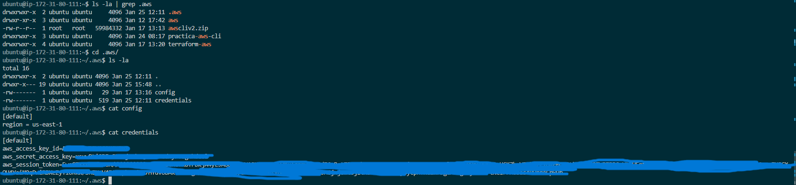

# Balanceador de carga en 3 niveles con AWS-CLI (IaC).

### Pero ¿qué es aws cli?
Es una herramienta, que se ejecuta a través de la linea de comandos, nos da la ventaja de que podemos gestionar todos los servicios de Amazon Web Service, tenemos pleno acceso a la api pública de los servidores de AWs, es decir, podemos usar todas las funciones, como si lo estuviesemos haciendo desde la consola de administrador

### Cual es el objetivo...
Crear scripts para automatizar la creación y administración de servicios de AWS.

# Primero tenemos que instalarla... 
### Se deben seguir los siguientes pasos.

**Paso 1** Descargamos el archivo .zip que contiene la aplicación de aws cli.
```
curl "https://awscli.amazonaws.com/awscli-exe-linux-x86_64.zip" -o "awscliv2.zip"
```

**Paso 2** Y lo descomprimimos, hay que tener en cuenta que tenemos que tener el ``unzip`` instalado.

```
unzip awscliv2.zip
```

**Paso 3** Ejecutamos el script de instalación.

```
sudo ./aws/install
```

**Paso 4** Y comprobamos la versión para ver si se instaló correctamente.

```
aws --version
```

Seguidamente ejecutamos:

```
aws configure
```
Y establecemos los valores deseados, cualquiera vale, posteriormente muestro como deben configurarse, ya que es necesario establecer una serie de credenciales para poder trabajar con aws via comandos.

Una vez establecidos los valores deseados... aparece un directorio oculto con dos fichero, en nuestro directorio de usuario.

Aparece lo siguiente.


Siguiendo esa ruta, accedemos a ese directorio y al contenido de ese fichero, hay que tener en cuenta que se debe configurar según los datos que aparezca en la opción ``"details" del laboratorio`` y que esas opciones cambian... con copiar y pegar en el fichero credentiales el contenido que aparece en los detalles para poder aportar las credenciales y trabajar con comandos, tambien hay que tener en cuenta que en el fichero config tenemos que establecer la ``región...`` cuando abrís los detalles del laboratorio lo podés consultar también.

Tras esta breve introducción muestro el contenido del directorio infraestructura_iac.

# Infraestructura como código empleando comandos.

A la hora de tener en cuenta un orden para ejecutar los scripts recomiendo, empezar por los **grupos de seguridad**, luego ejecutar el script de **creación** de instancias y por último el script que crea las **ips flotantes** y las asocia a las instancias de aws.

## 1. Script de creación de los grupos de seguridad.

### 1º Empezamos con la primera opción.
```
# Deshabilitamos la paginación de la salida de los comandos de AWS CLI
# Referencia: https://docs.aws.amazon.com/es_es/cli/latest/userguide/cliv2-migration.html#cliv2-migration-output-pager
export AWS_PAGER=""
```
Para evitar que el script se quede esperando a que interactuemos cuando requiere que realicemos una combinación de teclas y pueda continuar por su cuenta.

### 2º Se añaden las variables del fichero env, necesario para la creación de instancias y grupos.

```
# Importamos las variables de entorno
source .env
```
Estas variables:

```
# Instancias:
#Frontend 1 y 2
AMI_ID=ami-0c7217cdde317cfec 
COUNT=1 
INSTANCE_TYPE=t2.small 
KEY_NAME=vockey 
SECURITY_GROUP_FRONTEND=sg_frontend_iac 
INSTANCE_NAME_FRONTEND_1=frontend_1_iac
#----------------------------------#
INSTANCE_NAME_FRONTEND_2=frontend_2_iac

# Backend.
AMI_ID=ami-0c7217cdde317cfec 
COUNT=1 
INSTANCE_TYPE=t2.small 
KEY_NAME=vockey 
SECURITY_GROUP_BACKEND="sg_backend_iac"
INSTANCE_NAME_BACKEND="backend_iac"

# Servidor NFS
AMI_ID=ami-0c7217cdde317cfec 
COUNT=1 
INSTANCE_TYPE=t2.small 
KEY_NAME=vockey 
SECURITY_GROUP_NFS="sg_nfs_iac" 
INSTANCE_NAME_NFS="nfs_iac"

# Servidor Balanceador de carga.
AMI_ID=ami-0c7217cdde317cfec 
COUNT=1 
INSTANCE_TYPE=t2.small 
KEY_NAME=vockey 
SECURITY_GROUP_LOADBALANCER=sg_load_balancer_iac 
INSTANCE_NAME_LOADBALANCER=load_balancer_iac
```

### 3º Se crean los grupos de seguridad para el frontend.
```
# CREACIÓN DE LOS GRUPOS DE SEGURIDAD.

# Creamos el grupo de seguridad: frontend-sg
aws ec2 create-security-group \
    --group-name $SECURITY_GROUP_FRONTEND \
    --description "Reglas para el frontend"

# Creamos una regla de accesso SSH
aws ec2 authorize-security-group-ingress \
    --group-name $SECURITY_GROUP_FRONTEND \
    --protocol tcp \
    --port 22 \
    --cidr 0.0.0.0/0

# Creamos una regla de accesso HTTP
aws ec2 authorize-security-group-ingress \
    --group-name $SECURITY_GROUP_FRONTEND \
    --protocol tcp \
    --port 80 \
    --cidr 0.0.0.0/0

#---------------------------------------------------------------------
```
Podemos usar un mismo grupo de seguridad para frontend 1 y 2.

### 4º Se crea el grupo de seguridad para el backend. 
```
# Creamos el grupo de seguridad: backend-sg
aws ec2 create-security-group \
    --group-name $SECURITY_GROUP_BACKEND \
    --description "Reglas para el backend"

# Creamos una regla de accesso SSH
aws ec2 authorize-security-group-ingress \
    --group-name $SECURITY_GROUP_BACKEND \
    --protocol tcp \
    --port 22 \
    --cidr 0.0.0.0/0

# Creamos una regla de accesso para MySQL
aws ec2 authorize-security-group-ingress \
    --group-name $SECURITY_GROUP_BACKEND \
    --protocol tcp \
    --port 3306 \
    --cidr 0.0.0.0/0
```
Como podemos observar el patrón es el mismo, hay que tener en cuenta que las variables hay que saber donde las estamos poniendo y sobretodo no confundirse.

### 5º Se establece los grupos de seguridad para el servidor nfs.
```
# Creamos el grupo de seguridad: sg_nfs_iac
aws ec2 create-security-group \
    --group-name $SECURITY_GROUP_NFS \
    --description "Reglas para el servidor nfs"

# Creamos una regla de accesso SSH
aws ec2 authorize-security-group-ingress \
    --group-name $SECURITY_GROUP_NFS \
    --protocol tcp \
    --port 22 \
    --cidr 0.0.0.0/0

# Creamos una regla de accesso para nfs
aws ec2 authorize-security-group-ingress \
    --group-name $SECURITY_GROUP_NFS \
    --protocol tcp \
    --port 2049 \
    --cidr 0.0.0.0/0
```

### Se establecen los grupos de seguridad para el balanceador de carga.
```
# Balanceador
# Creamos una regla de accesso HTTPs
aws ec2 create-security-group \
    --group-name $SECURITY_GROUP_LOADBALANCER \
    --description "Reglas para el loadbalancer"

aws ec2 authorize-security-group-ingress \
    --group-name $SECURITY_GROUP_LOADBALANCER \
    --protocol tcp \
    --port 443 \
    --cidr 0.0.0.0/0
# para el puerto 80
aws ec2 authorize-security-group-ingress \
    --group-name $SECURITY_GROUP_LOADBALANCER \
    --protocol tcp \
    --port 80 \
    --cidr 0.0.0.0/0
# para el puerto 22
aws ec2 authorize-security-group-ingress \
    --group-name $SECURITY_GROUP_LOADBALANCER \
    --protocol tcp \
    --port 22 \
    --cidr 0.0.0.0/0
```

Le ponemos el 443 ya que es el que mostrará el contenido de frontend 1 y 2 mediante un proxy inverso.

# 2. Script de creación de las instancias.
En este script, se van a crear las instancias y mediante su creación se les van a asignar automáticamente los grupos de seguridad creados previamente por el fichero ``grupos_seguridad.sh``.

### Cargamos las variables en el fichero .env.
```
# Variables de configuración
source .env
```

## Creación de instancias en AWS.
### Creamos una instancia para el balanceador de carga.
```
# Creamos una instancia para el balanceador de carga.
aws ec2 run-instances \
    --image-id $AMI_ID \
    --count $COUNT \
    --instance-type $INSTANCE_TYPE \
    --key-name $KEY_NAME \
    --security-groups $SECURITY_GROUP_LOADBALANCER \
    --tag-specifications "ResourceType=instance,Tags=[{Key=Name,Value=$INSTANCE_NAME_LOADBALANCER}]"
```

Los parametros a entender son los siguientes:

```
    --image-id $AMI_ID \ Con esto se refiere al id de imagen de la instancia.
    --count $COUNT \ Con esto hablamos sobre la cantidad de instancias que queremos de ese tipo.
    --instance-type $INSTANCE_TYPE \ Con esto vemos el tipo de instancia --> small...
    --key-name $KEY_NAME \ El nombre de la clave de aws.
    --security-groups $SECURITY_GROUP_LOADBALANCER \ La variable con el nombre del grupo de seguridad
    --tag-specifications "ResourceType=instance,Tags=[{Key=Name,Value=$INSTANCE_NAME_LOADBALANCER}]" Y la etiqueta que se le da como nombre a la instancia.
```
El proceso para la creación de instancias, es el mismo para todas las demas instancias, siguen la misma nomenclatura explicada anteriormente: ``id de imagen``,``cantidad de instancia``,``nombre de la clave``, ``grupos de seguridad``, ``etiqueta para el nombre de instancia``.
```
# Creamos las intancias EC2 para los frontends 1 y 2.
aws ec2 run-instances \
    --image-id $AMI_ID \
    --count $COUNT \
    --instance-type $INSTANCE_TYPE \
    --key-name $KEY_NAME \
    --security-groups $SECURITY_GROUP_FRONTEND \
    --tag-specifications "ResourceType=instance,Tags=[{Key=Name,Value=$INSTANCE_NAME_FRONTEND_1}]"
```

```
aws ec2 run-instances \
    --image-id $AMI_ID \
    --count $COUNT \
    --instance-type $INSTANCE_TYPE \
    --key-name $KEY_NAME \
    --security-groups $SECURITY_GROUP_FRONTEND \
    --tag-specifications "ResourceType=instance,Tags=[{Key=Name,Value=$INSTANCE_NAME_FRONTEND_2}]"
```

### Creamos la instancia para el backend.

```
# Creamos una intancia EC2 para el backend
aws ec2 run-instances \
    --image-id $AMI_ID \
    --count $COUNT \
    --instance-type $INSTANCE_TYPE \
    --key-name $KEY_NAME \
    --security-groups $SECURITY_GROUP_BACKEND \
    --tag-specifications "ResourceType=instance,Tags=[{Key=Name,Value=$INSTANCE_NAME_BACKEND}]"
```


### Creamos la instancia para el servidor nfs.
```
# Creamos una instancia EC2 para el servidor nfs.

aws ec2 run-instances \
    --image-id $AMI_ID \
    --count $COUNT \
    --instance-type $INSTANCE_TYPE \
    --key-name $KEY_NAME \
    --security-groups $SECURITY_GROUP_NFS \
    --tag-specifications "ResourceType=instance,Tags=[{Key=Name,Value=$INSTANCE_NAME_NFS}]"
```
Como podemos comprobar todas poseen sus variables, las cuales se encuentran definidas en el fichero ``.env`` si quisieramos cambiar el contenido de las variables, solo tendriamos que modificar los parametros del fichero ``.env``.

# 3. Script para la creación de ips flotantes.
Y por último toca la creación de las ips flotantes para las instancias anteriores, para ello, necesitamos recoger el identificado de las instancias, para poder asignarles las ips flotantes.

### 1º Importamos las variables del fichero .env.
```
# Importamos las variables de entorno
source .env
```

### 2º Obtenemos los identificadores de cada instancia creada.
Con el siguiente comando almacenamos en una variable que usaremos mas adelante, dicha variable almacena el id, con objetivo de asociarlo a la ip flotante.

#### Obtención del id de la máquina frontend1
```
# Obtenemos el Id de la instancia a partir de su nombre.
# Recoger el id de la instancia del frontend 1.
INSTANCE_ ID_frontend1=$(aws ec2 describe-instances \
            --filters "Name=tag:Name,Values=$INSTANCE_NAME_FRONTEND_1" \
                      "Name=instance-state-name,Values=running" \
            --query "Reservations[*].Instances[*].InstanceId" \
            --output text)
```
#### Obtención del id de la máquina frontend2
```
# Recoger el id de la instancia del frontend 2.
INSTANCE_ID_frontend2=$(aws ec2 describe-instances \
            --filters "Name=tag:Name,Values=$INSTANCE_NAME_FRONTEND_2" \
                      "Name=instance-state-name,Values=running" \
            --query "Reservations[*].Instances[*].InstanceId" \
            --output text)
```
#### Obtención del id de la máquina backend.
```
# Recogemos el id de la instancia del backend.
#INSTANCE_ID_backend=$(aws ec2 describe-instances \
#            --filters "Name=tag:Name,Values=$INSTANCE_NAME_BACKEND" \
#                      "Name=instance-state-name,Values=running" \
#            --query "Reservations[*].Instances[*].InstanceId" \
#            --output text)
```
Se encuentra comentada ya que no me deja crear mas de 5 ip elásticas.

#### Obtención del id de la instancia nfs.
```
# Recogemos el id de la instancia del nfs.
INSTANCE_ID_nfs=$(aws ec2 describe-instances \
            --filters "Name=tag:Name,Values=$INSTANCE_NAME_NFS" \
                      "Name=instance-state-name,Values=running" \
            --query "Reservations[*].Instances[*].InstanceId" \
            --output text)
```
Lo que hace el comando situado en la variable que almacena el id, esta aplicando una consulta, la cual filtra por el **nombre de la instancia** en este caso la del **servidor nfs** y tambien filtra por el **valor running**, el cual hace referencia a si está en ejecución, moviendose por el contenido de la consulta la cual, **su extensión es json** va moviendose por el fichero json hasta alcanzar el **id de la instancia** almacenado en ese fichero.

#### Obtención del id de la instancia load_balancer.
```
# Recogemos el id de la instancia del loadbalancer.
INSTANCE_ID_loadbalancer=$(aws ec2 describe-instances \
            --filters "Name=tag:Name,Values=$INSTANCE_NAME_LOADBALANCER" \
                      "Name=instance-state-name,Values=running" \
            --query "Reservations[*].Instances[*].InstanceId" \
            --output text)
```

## Creamos las ips elasticas.
```
# Creamos una IP elástica
ELASTIC_IP_f1=$(aws ec2 allocate-address --query PublicIp --output text)
ELASTIC_IP_f2=$(aws ec2 allocate-address --query PublicIp --output text)
#ELASTIC_IP_b=$(aws ec2 allocate-address --query PublicIp --output text)
ELASTIC_IP_nfs=$(aws ec2 allocate-address --query PublicIp --output text)
ELASTIC_IP_lb=$(aws ec2 allocate-address --query PublicIp --output text)
```
Empleamos una consulta la cual dicho comando genera ips flotantes y las muestra como texto esa salida la mandamos a una variable, almacenando dicha ip en esa variable, guardandola para asociarla a una instancia.

## Asociamos las ips a las instancias.
```python
# Asociamos las ips a las máquinas.
aws ec2 associate-address --instance-id $INSTANCE_ID_frontend1 --public-ip $ELASTIC_IP_f1
aws ec2 associate-address --instance-id $INSTANCE_ID_frontend2 --public-ip $ELASTIC_IP_f2
#aws ec2 associate-address --instance-id $NSTANCE_ID_backend --public-ip $INSTANCE_NAME_BACKEND
aws ec2 associate-address --instance-id $INSTANCE_ID_nfs --public-ip $ELASTIC_IP_nfs
aws ec2 associate-address --instance-id $INSTANCE_ID_loadbalancer --public-ip $ELASTIC_IP_lb
```

La estructura del comando es la siguiente:

```python
aws ec2 associate-address --instance-id $INSTANCE_ID_frontend1 --public-ip $ELASTIC_IP_f1
```
Anteriormente, se almacenó el id de instancia en la variable **$INSTANCE_ID_frontend1** y hemos asignado a la siguiente variable una ip flotante $ELASTIC_IP_f1 con esto comando, empleando la sintaxis perteneciente al comando associate-address asociamos esa ip almacenada en la variable al id de esa instancia.

# Métodos de ejecución.
Ejecución de los script, si los ejecutáis con sudo dara errores... ejecutarlo solamente con ``./nombre_script.sh``.

**1º** Ejecución del script grupos_seguridad.sh
```
./grupos_seguridad.sh
```

**2º** Ejecución del script creacion_instancias.sh
```
./creacion_instancias.sh
```

**2º** Ejecución del script ip_flotantes.sh
```
./ip_flotantes.sh
```

Cabe destacar que esto se tiene que hacer en la ruta donde se encuentren dichos scripts...